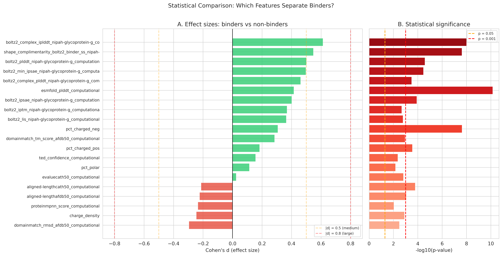
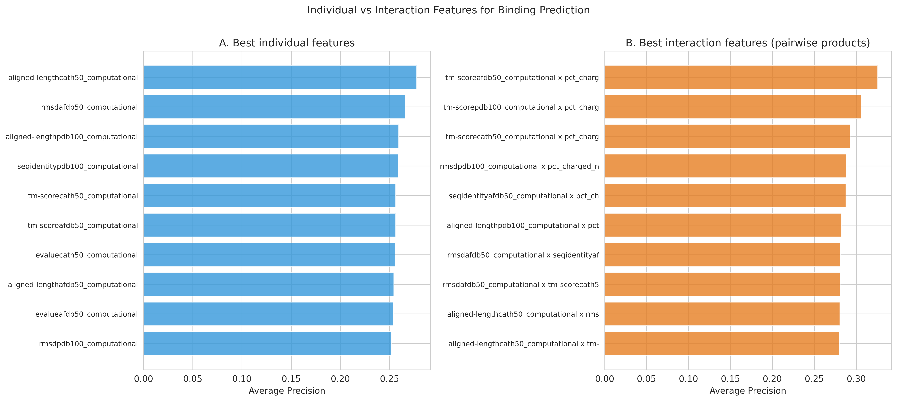
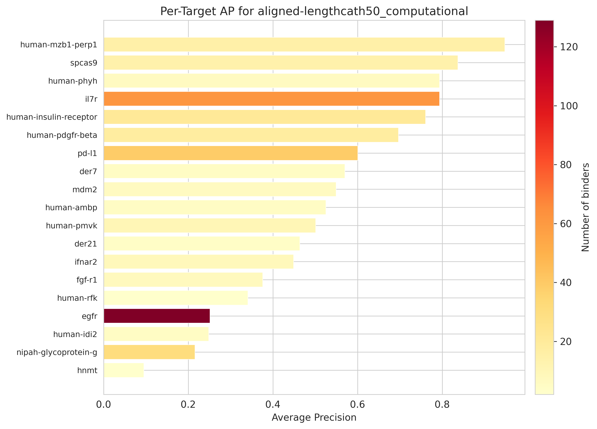
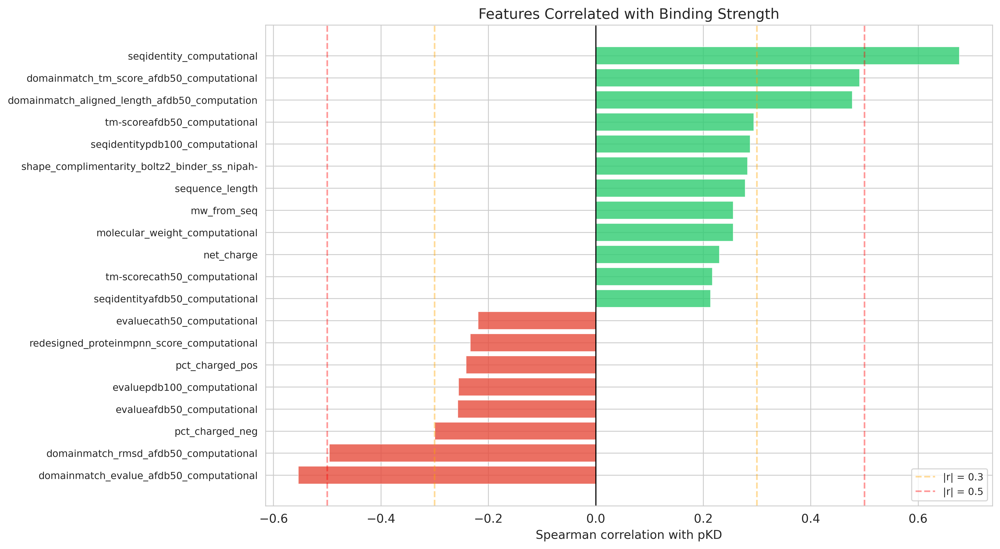
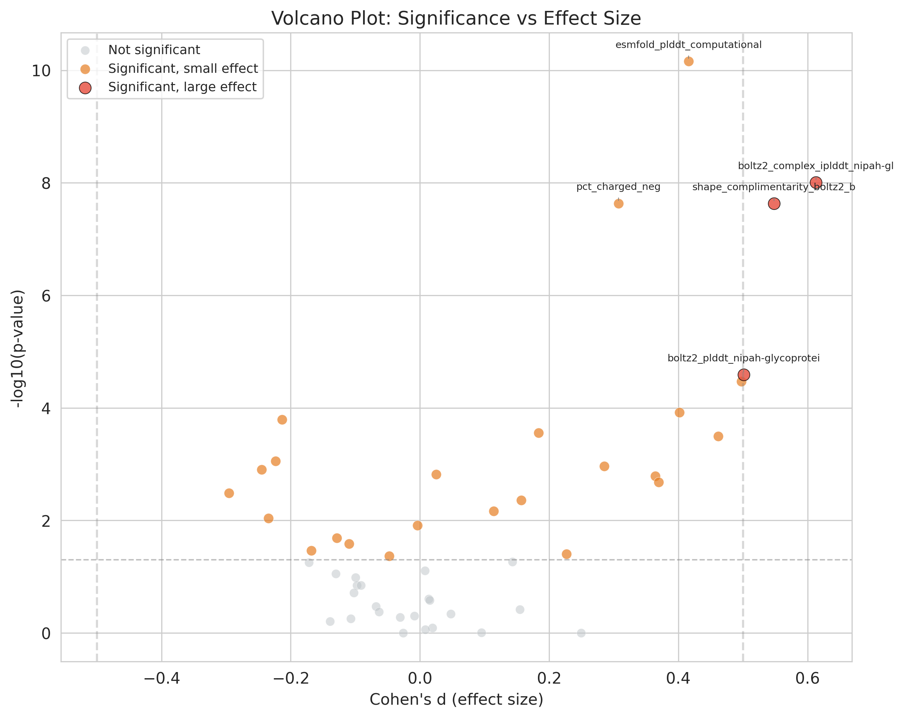
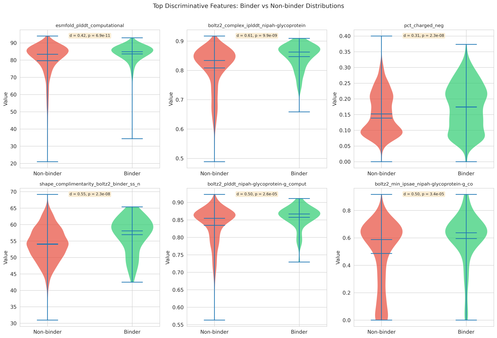
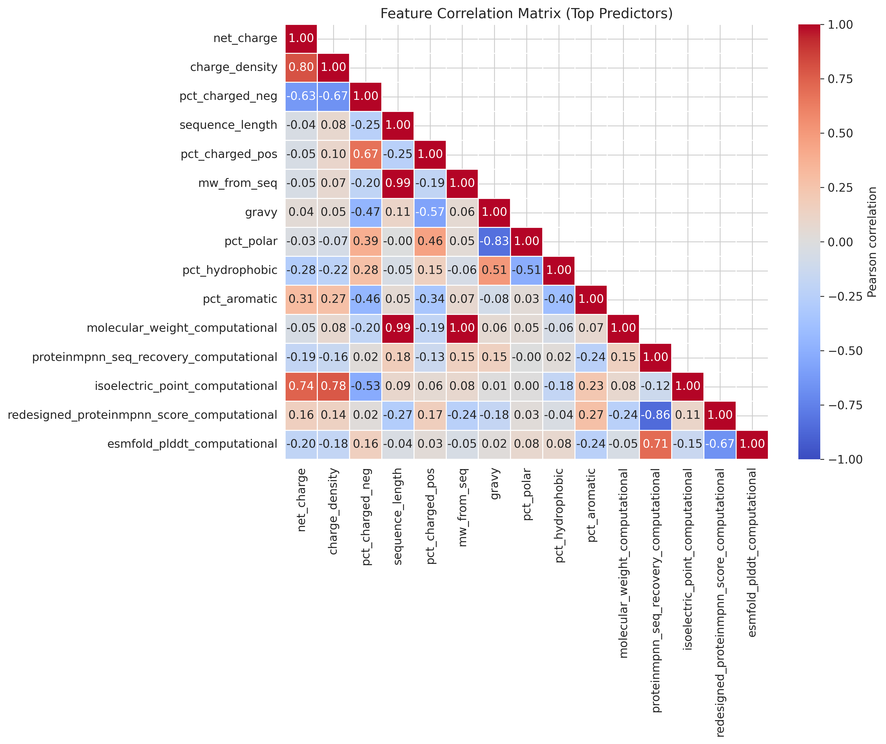
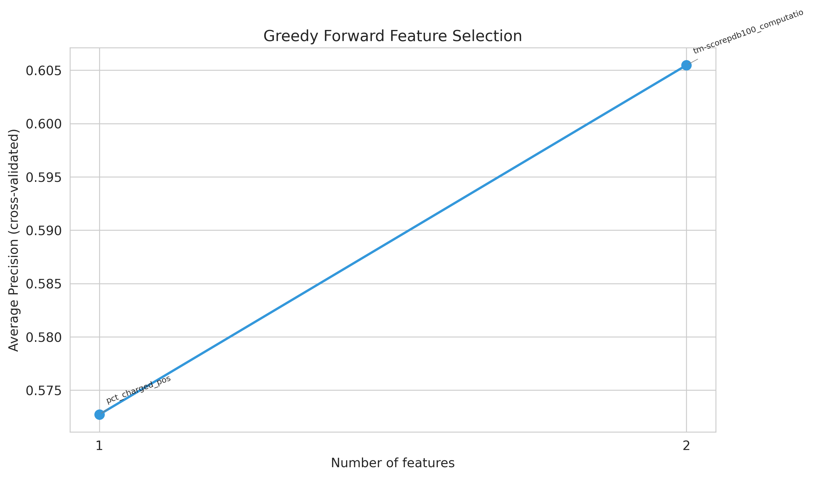
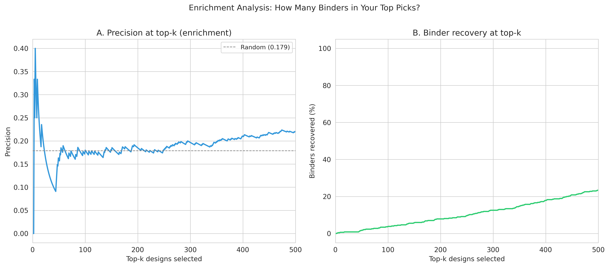

# WillItBind

Predicting experimental protein binding from computational features across 5,253 de novo designs and 24 targets.

An expanded analysis extending the methodology of [Overath et al. (2025)](https://doi.org/10.1101/2025.08.14.670059) from 3,766 binders across 15 targets to 5,253 designs across 24 targets. The dataset includes sequence information, computational predictions from ESMFold, Boltz2, ProteinMPNN, and structural homology searches, paired with experimental binding data (KD, Kon, Koff) from surface plasmon resonance and bio-layer interferometry.

## The Question

You have designed thousands of protein binders on a computer. Before spending months and money on wet-lab experiments, you want to know: which ones will actually bind?

This repository analyzes what computational metrics can tell you, how much they can tell you, and where they fall short.

## Dataset at a Glance

| Statistic | Value |
|---|---|
| Total protein designs | 5,253 |
| Protein-target pairs with binding data | 2,630 |
| Experimentally confirmed binders | 470 (17.9%) |
| Unique targets | 24 |
| Computational features analyzed | 49 |
| Targets with >50 samples | 5 |
| Binding rate range across targets | 0% to 70% |

## Key Findings

### 1. ESMFold pLDDT is the most universally significant predictor

Across 2,600+ protein-target pairs, ESMFold pLDDT separates binders from non-binders with the strongest statistical support (p = 6.9e-11, Cohen's d = +0.42). Binders have higher predicted confidence, consistent with the finding from Overath et al. that structure prediction confidence (specifically ipSAE from AF3) is the single most reliable indicator of binding success.



The top three features by effect size are all Boltz2-derived metrics for the nipah-glycoprotein-g target: complex iPLDDT (d = 0.61), shape complementarity (d = 0.55), and pLDDT (d = 0.50). Across all targets, 26 out of 49 features reach statistical significance at p < 0.05.

### 2. Interaction features improve prediction by 17%

Following Overath et al., who found that products of confidence metrics and physicochemical descriptors capture complementary information, we tested all pairwise products of the top 15 individual features. The best interaction (TM-score x charged residue fraction) achieves AP = 0.326 compared to 0.278 for the best individual feature, a 17.3% improvement.



This confirms the key insight from Overath et al.: combining structure-based confidence with sequence-derived physicochemical properties provides predictive power that neither captures alone.

### 3. Target variability is the biggest challenge

Per-target Average Precision ranges from 0.10 to 0.95, consistent with Overath et al.'s finding of 0.1 to 1.0 variation. Some targets (il7r, spcas9) are highly predictable while others (hnmt, nipah with large n) remain difficult.



Targets with fewer binders relative to non-binders are generally harder to predict. The binding success rate itself varies from 0% (human-serum-albumin, human-tnfa) to 70% (spcas9), suggesting that target tractability is at least as important as computational scoring.

### 4. Sequence identity to known proteins is the strongest affinity predictor

For designs that do bind, what predicts how strongly they bind? Sequence identity to known proteins (Spearman r = 0.68 with pKD) dominates, followed by domain match e-value (r = -0.55) and RMSD (r = -0.50). This suggests that designs resembling known functional proteins tend to bind more tightly.



### 5. Volcano plot reveals the full feature landscape

The volcano plot integrates statistical significance (p-value) with practical significance (effect size). The upper corners contain the most actionable features: those with both large effects and high statistical confidence.



### 6. Distribution differences are visible in the top features

Violin plots for the six most discriminative features show clear separation between binder and non-binder distributions, though with substantial overlap. No single feature achieves clean separation.



### 7. Feature correlations reveal redundancy and complementarity

The correlation heatmap of the top 15 features shows clusters of highly correlated metrics (e.g., TM-scores across databases, sequence identities across databases). For modeling, selecting one representative from each cluster avoids redundancy.



### 8. Greedy selection converges quickly

Consistent with Overath et al., who found that only 2 to 5 features are needed before additional features introduce noise, our greedy forward selection with Leave-One-Group-Out cross-validation converges at 2 features. The selected features (charged residue fraction + TM-score) achieve cross-validated AP = 0.61.



### 9. Enrichment curves show practical utility

When ranking designs by model score and selecting the top-k, precision drops from ~50% in the top 10 to ~20% in the top 100. The model recovers binders at 3 to 5 times the rate of random selection.



### 10. Charged residue content is the most consistent predictor across targets

Appearing in the top-5 predictors for 6 out of 24 targets, negative charge density is the most consistent cross-target feature. Other consistent features include hydrophobicity (5 targets), ProteinMPNN redesign score (5 targets), and gravy index (5 targets). This highlights the importance of sequence composition beyond structure-based confidence scores.

## Practical Recommendations

Based on our analysis of this expanded dataset:

**Tier 1: Universal filters (apply to all designs)**
- ESMFold pLDDT (higher is better for binding)
- Charged residue fraction (strong discriminator across 6 targets)

**Tier 2: Target-specific scoring (when Boltz2/AF3 predictions available)**
- Boltz2 ipSAE, shape complementarity, LIS
- Overath et al. recommend: AF3 ipSAE_min > 0.61

**Tier 3: Affinity prediction**
- Sequence identity to known proteins (r = 0.68 with pKD)
- Domain match metrics from AFDB50

**Interaction features for improved enrichment:**
- TM-score x charged residue fraction (AP = 0.326, +17% over best individual)

**Filtering strategy:**
1. Pre-filter on ESMFold pLDDT (remove low-confidence designs)
2. Rank by Boltz2 ipSAE or TM-score x charge interaction
3. Select top-k for experimental testing (k = 10 to 50 per target)

## Project Structure

```
willitbind/
  __init__.py              # Package init
  data.py                  # Data loading, parsing, sequence properties
  features.py              # Statistical tests, AP ranking, LASSO, interactions
  models.py                # Logistic regression, greedy selection, evaluation
  plots.py                 # 18 publication-quality figure generators
scripts/
  run_analysis.py          # Complete pipeline (runs all 14 steps)
notebooks/
  willitbind_analysis.ipynb  # Interactive analysis notebook
results/
  figures/                 # 20 generated PNG figures (300 DPI)
  tables/                  # CSV results tables
proteinbase_all_data_28_01_2026.csv  # Raw dataset (5,253 designs)
```

## Quick Start

### Install dependencies

```bash
pip install pandas numpy scikit-learn matplotlib seaborn scipy
```

### Run the full analysis

```bash
python scripts/run_analysis.py
```

This generates all figures in `results/figures/` and all tables in `results/tables/`.

### Use the Python API

```python
from willitbind import BinderDataset, FeatureAnalyzer, WillItPlot

# Load data
ds = BinderDataset('proteinbase_all_data_28_01_2026.csv')
ds.load()
adf = ds.analysis_dataset()
features = ds.usable_features()

# Analyze features
analyzer = FeatureAnalyzer(adf, features)
stats = analyzer.binder_vs_nonbinder()       # Mann-Whitney U tests
ap_df = analyzer.single_feature_ap()          # Average Precision ranking
interactions = analyzer.interaction_feature_ap()  # Pairwise products
corr = analyzer.pkd_correlations()            # Affinity correlations

# Generate figures
plotter = WillItPlot(output_dir='results/figures')
plotter.dataset_overview(adf, features)
plotter.effect_sizes(stats)
plotter.volcano(stats)
```

### Run the notebook

```bash
jupyter notebook notebooks/willitbind_analysis.ipynb
```

## Methodology

Following and extending Overath et al. (2025):

1. Parse 5,253 designs with JSON-encoded evaluations
2. Separate computational features from experimental labels (no data leakage)
3. Compute sequence-derived physicochemical properties (MW, charge, hydrophobicity, etc.)
4. Statistical testing: Mann-Whitney U for binary binding, Spearman for affinity
5. Single feature Average Precision ranking (preferred over AUC-ROC for imbalanced data)
6. Pairwise interaction features (confidence x physicochemical products)
7. Per-target analysis across 24 targets
8. LASSO feature selection (L1 logistic regression and L1 linear regression)
9. Greedy forward feature selection with Leave-One-Group-Out CV by target
10. Model training, threshold optimization, enrichment curves
11. Feature consistency analysis across targets

## Generated Outputs

### Figures (20 plots)

| Figure | Description |
|---|---|
| fig1_dataset_overview | Multi-panel dataset summary (targets, rates, affinity distribution) |
| fig2_effect_sizes | Cohen's d and p-values for binder vs non-binder |
| fig3_volcano | Significance vs effect size landscape |
| fig4_pkd_correlations | Spearman correlations with binding affinity |
| fig5_top_violins | Distribution comparisons for top 6 features |
| fig6_lasso_binary | LASSO coefficients for binary binding |
| fig6_lasso_pkd | LASSO coefficients for affinity prediction |
| fig7_per_target | Sample sizes, binding rates, and effects per target |
| fig8_pkd_scatters | Scatter plots of top features vs pKD |
| fig9_correlation_heatmap | Feature intercorrelation matrix |
| fig10_design_methods | Comparison across design methods |
| fig11_greedy_progress | Greedy selection convergence curve |
| fig12_pr_roc | Precision-Recall and ROC curves |
| fig13_threshold | Threshold optimization (precision, recall, F1) |
| fig14_confusion | Confusion matrix at optimal threshold |
| fig15_enrichment | Precision at top-k and binder recovery curves |
| fig16_single_feature_ap | Average Precision ranking of all features |
| fig17_interaction_features | Individual vs interaction feature comparison |
| fig18_per_target_ap | Per-target AP for best feature |

### Tables (14 CSV files)

| Table | Description |
|---|---|
| analysis_dataset.csv | Full long-format dataset (protein-target pairs) |
| binder_vs_nonbinder_stats.csv | Mann-Whitney U results for all features |
| single_feature_ap.csv | Average Precision for each feature |
| interaction_feature_ap.csv | AP for pairwise feature products |
| pkd_correlations.csv | Spearman correlations with pKD |
| per_target_summary.csv | Summary statistics per target |
| per_target_ap_best_feature.csv | AP of best feature per target |
| lasso_binary_selected.csv | LASSO-selected features (binding) |
| lasso_pkd_selected.csv | LASSO-selected features (affinity) |
| greedy_selected_features.csv | Greedy selection results |
| feature_consistency.csv | Cross-target feature consistency |
| predictions.csv | Model predictions |
| model_metrics.csv | Model performance metrics |
| model_coefficients.csv | Trained model coefficients |

## Citation

This analysis builds on and extends:

> Overath MD, Rygaard ASH, Jacobsen CP, et al. "Predicting Experimental Success in De Novo Binder Design: A Meta-Analysis of 3,766 Experimentally Characterised Binders." bioRxiv (2025). doi:10.1101/2025.08.14.670059

## License

MIT
